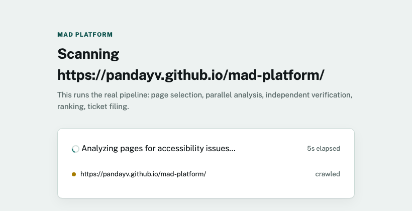
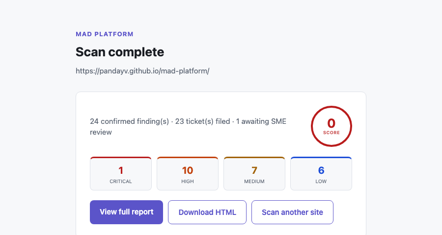

# MAD Platform

**An autonomous agent that scans a website for accessibility problems,
verifies its own findings, and takes real action on what's confirmed — not
just a report.**

Built for the [All Things Agentic Hackathon](https://allthingsagentichackathon.devpost.com/)
on Gemini, Google's Agent Development Kit (ADK), and Google Cloud.

---

## Try it live

**[scan-onboarding-803013053073.us-central1.run.app](https://scan-onboarding-803013053073.us-central1.run.app)**
— paste in a URL and watch it scan. Access is gated by a code (a
deliberate security measure — see *Tech stack* below).

**[Guardian Pest Control](https://pandayv.github.io/mad-platform/)** — a
small fictional business site, seeded with real accessibility violations,
built to give the scanner a consistent, reliable target ([`docs/`](docs/)).

**[Architecture diagram](https://pandayv.github.io/mad-platform/architecture.html)**
— the full pipeline, the WCAG auto-heal loop, and the Google Cloud
infrastructure behind it.

## The problem

Website-accessibility lawsuits (ADA-related, in the US) are a real and
growing risk for small businesses, most of whom have no practical way to
know they're exposed. Manual accessibility audits are expensive and slow.
Automated scanners exist, but they're noisy — full of false positives a
non-technical business owner can't triage — and a report alone doesn't fix
anything; someone still has to turn it into work that gets done.

MAD Platform removes that blind spot: point it at a URL, and it finds real
issues, checks its own work before trusting it, explains what matters most
in plain language, and files the confirmed ones as tickets automatically —
while routing the genuinely uncertain ones to a human instead of guessing.

## What makes this different

Most accessibility scanners stop at detection. Four things here go
further, and most agentic projects don't attempt any of them together:

**It remembers — and its judgment measurably improves because of it.**
Every dismissed finding keeps its reason. A second, self-hosted model —
Gemma, not Gemini, running on its own Cloud Run Job — periodically mines
that history for patterns no one's flagged yet: the same false positive,
dismissed the same way, across scans of completely unrelated sites. A
human confirms each real pattern once, and it becomes permanent grounding
for every scan after that. This isn't a cache or a prompt template — it's
the pipeline's actual judgment changing based on its own accumulated
experience, proven against this project's real usage history, not
synthetic examples built to demo well.

**It watches its own knowledge for drift, not just the website's.**
WCAG itself changes over time. A scheduled check compares the standard's
current version against what the knowledge base was built on, classifies
what changed, and either refreshes automatically (additive, low-risk
updates) or stops and asks a person first (anything structural). The
reference material a citation is grounded in never goes stale, and it
never gets silently reinterpreted without oversight either.

**It sees the rendered page, not just the markup.**
One of Analyst's three parallel checks is genuinely multimodal: a real
screenshot of the live page goes to Gemini for visual judgment — focus
indicators, actual rendered contrast — the things that exist on screen
but never show up in the HTML source. Vision doing real work in the
pipeline, not a label on a text-only system.

**It acts, and the action is accountable.**
A confirmed finding becomes a real Jira ticket, automatically. Anything
critical or uncertain routes to a human instead, with a live Slack alert
the moment it happens — not a silent queue nobody checks. Every action is
idempotent, so a retried step never double-files: autonomous doesn't mean
unaccountable here.

## What it does

1. **Scans a site autonomously** — decides which pages matter most on its
   own (home, contact, forms), then checks them with both deterministic
   rule checks (contrast, missing alt text, heading structure, form
   labels, ARIA misuse, tab order) and AI-assisted review for what rules
   can't judge, like whether alt text is actually descriptive.
2. **Verifies its own findings** — every flag is independently
   double-checked before it's trusted; false positives get dismissed with
   a documented reason, real findings get a confidence score.
3. **Ranks by real-world risk** — not raw technical severity: WCAG
   conformance level, how often that violation type shows up in real
   accessibility litigation, and estimated user impact.
4. **Produces an actionable report** — a styled, self-contained HTML
   report with an overall score, severity breakdown, plain-English
   executive summary, and a concrete suggested fix per finding.
5. **Takes real action** — files a ticket automatically for every
   confirmed finding; routes the low-confidence or critical minority to a
   human reviewer instead, who can confirm or dismiss.
6. **Recovers from failure** — a scan interrupted mid-way (crash, redeploy)
   resumes from its last completed checkpoint rather than starting over or
   silently duplicating work.
7. **Keeps its own reference material current** — periodically checks
   whether the WCAG standard itself has changed, auto-refreshing for minor
   additive updates and routing structural changes to human review before
   acting on them.

## Try it yourself: what a scan looks like

Paste a URL into the web app, and watch it work:



When it's done, you get a score, a severity breakdown, and the full report:



## How it works

The mechanics behind the four differentiators above:

- **The right orchestration pattern for each step.** Pipeline stages that
  must happen in order run sequentially (crawl → analyze → verify → rank
  → act → report); independent per-page checks run in parallel; dynamic
  delegation is reserved for genuine judgment calls, like which pages are
  worth scanning or whether a page's analysis needs a second pass, capped
  at exactly one retry — never an open-ended loop.
- **Resumability as a real mechanism, not a claim.** Every stage
  checkpoints its completion to Firestore as it finishes. A restart —
  crash, redeploy — resumes from the last completed stage instead of
  starting over or silently duplicating work.
- **Citations grounded in retrieval, not recollection.** WCAG success
  criteria are embedded once and retrieved to back every finding, so a
  citation reflects the actual standard rather than an LLM's unverified
  memory of it.
- **The Gemma memory loop, concretely.** Cloud Scheduler triggers a
  dedicated Cloud Run Job weekly; Ollama serves `gemma3:4b` inside it,
  baked into the image rather than pulled per run; the job clusters
  Editor's real dismissal history by WCAG criterion and proposes anything
  consistent through the same SME review queue as everything else.

Every irreversible action — filing a ticket, refreshing the knowledge base,
adopting a learned pattern — is either idempotent, gated behind human
approval, or both: a retried pipeline step never double-files, and nothing
that changes future judgment gets auto-applied without a person looking at
it first.

## Product layer vs. platform layer

- **Product layer (built):** a place to come check your website's
  accessibility and get an actionable report — one-time, on-demand, no
  registration required. Everything above is this layer.
- **Platform layer (on the roadmap):** registering a site for *ongoing*
  monitoring, detecting when a registered site's code changes, and the
  recurring scheduling that ties it together.

## Tech stack

- **AI:** Gemini via Vertex AI (`gemini-3.5-flash-lite` for high-volume
  calls, `gemini-3.7-flash` for judgment calls) for every real-time,
  user-facing call; a self-hosted Gemma (`gemma3:4b` via Ollama, its own
  Cloud Run Job) for the one background batch job (dismissal-pattern
  mining) that has no live-latency pressure
- **Agent framework:** Google Agent Development Kit (ADK)
- **Compute:** Cloud Run — four scale-to-zero services split by trigger
  type and resource profile, plus one Cloud Run Job for the Gemma batch
  miner
- **State:** Firestore — job checkpoints, findings, escalation queue,
  WCAG knowledge-base embeddings, confirmed learned patterns
- **Storage:** Cloud Storage — generated reports
- **Scheduling:** Cloud Scheduler — drives the WCAG freshness check
  (every 6h) and the dismissal-pattern miner (weekly)
- **Browser automation:** Playwright — headless rendering, screenshots,
  computed-style extraction for real contrast-ratio checking
- **Web:** FastAPI — the scan-submission UI and status API
- **Ticketing:** Jira REST API, behind an abstraction (`IssueSink`) so a
  second tracker could be added without touching Orchestrator or Reporter
- **Notifications:** Slack, via an incoming webhook — a real-time alert
  when a finding or a WCAG version change is escalated to a human, a
  summary posted when a scan completes
- **Security:** the public scan endpoint requires an access code (Secret
  Manager) and the crawler refuses to fetch private/internal network
  addresses

## Local setup

```bash
git clone https://github.com/pandayv/mad-platform.git
cd mad-platform
python3 -m venv .venv && source .venv/bin/activate
pip install -r requirements.txt
playwright install --with-deps chromium

# Requires a GCP project with Vertex AI, Firestore, and Cloud Storage
# enabled, and application-default credentials configured:
gcloud auth application-default login

# Run a scan from the CLI (no frontend needed for this):
python run_scan.py https://example.com

# Or run the web app locally:
uvicorn mad_platform.web.app:app --port 8080
```

See [`SETUP.md`](SETUP.md) for the full GCP provisioning guide.
[`gcp-deploy.sh`](gcp-deploy.sh) covers the core services, Firestore
database, Pub/Sub topics, and service accounts; `SETUP.md` has the exact
commands for the one piece it doesn't cover, the Gemma pattern-miner
Cloud Run Job.

## Project structure

```
mad_platform/
  agents/        # Orchestrator, Analyst, Editor, Reporter, Action Agent,
                  # WCAG auto-heal, Pattern Miner (Gemma persistent memory)
  tools/         # Crawler, rule checks, AI checks, ADK client, Gemma
                  # client, RAG, WCAG version fetch, issue sink, Slack notify
  state/         # Firestore + Cloud Storage clients
  web/           # Scan-submission UI, status page, SME review queue,
                  # the WCAG-poller HTTP entrypoint, shared theme/charts
  data/          # Curated WCAG success-criteria corpus
docs/            # Demo site + self-hosted architecture diagram (GitHub Pages)
run_scan.py                    # CLI entry point for a one-time scan
review_escalations.py          # SME review queue CLI (web UI is the primary surface)
check_wcag_version.py          # Manual trigger for the WCAG freshness check
mine_patterns.py               # Manual trigger for the Gemma pattern miner
Dockerfile / Dockerfile.wcag_poller / Dockerfile.pattern_miner
SETUP.md                       # GCP provisioning guide
gcp-deploy.sh / gcp-cleanup.sh # Infrastructure-as-code (core services)
```

## Built during the hackathon submission window

Solo build by Vipul Panday, drawing on a professional background in risk
management and compliance.
